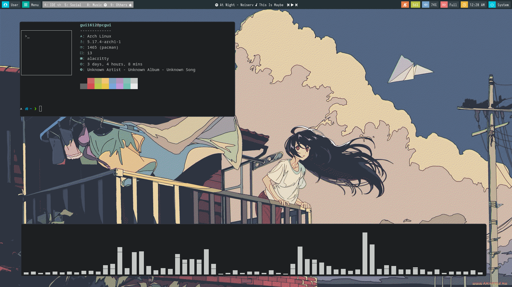

Prints were taken with Neofetch

#Applications

*OS:* Arch Linux

*Aur helper:* yay

*Shell:* Zsh (theme: [Powerlevel10k](https://github.com/romkatv/powerlevel10k))

*Bar:* Polybar

*Terminal:* Alacritty

*LockScreen:* betterlockscreen

*Compositor:* Picom

*Launcher:* Rofi

*Browser:* Firefox Developer Edition / Brave

*Development Environment:* VSCode (my extensions)

*File Manager:* Thunar

*Audio:* pavucontrol

*Multitouch gesture recognizer:* Fusuma

*Text Editor:* Neovim

*Dotfile Manager:* Yadm
